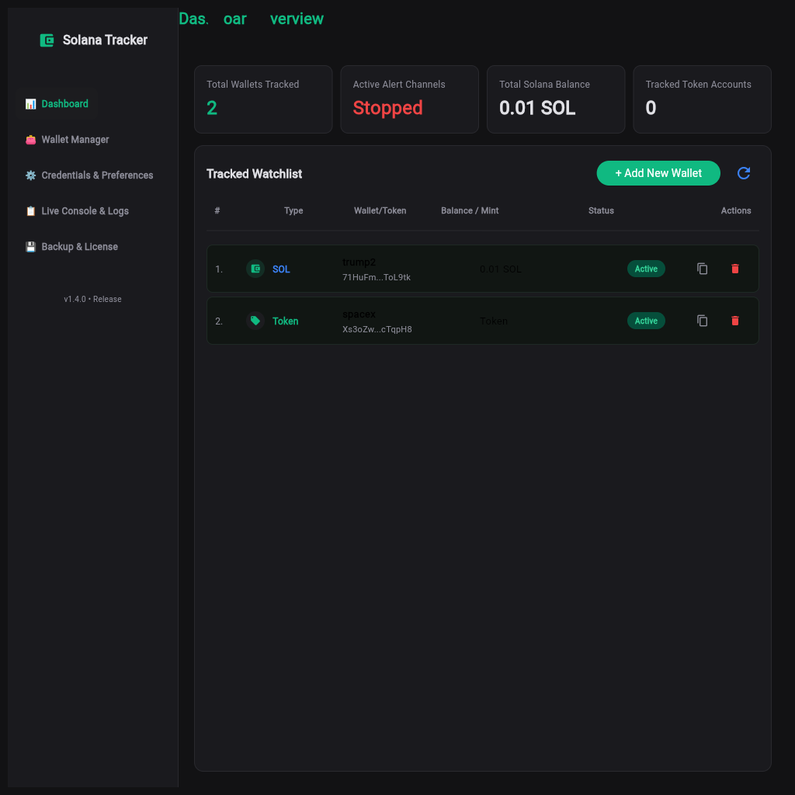
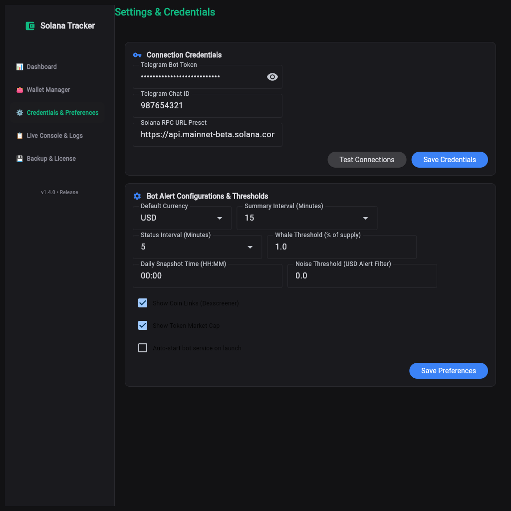
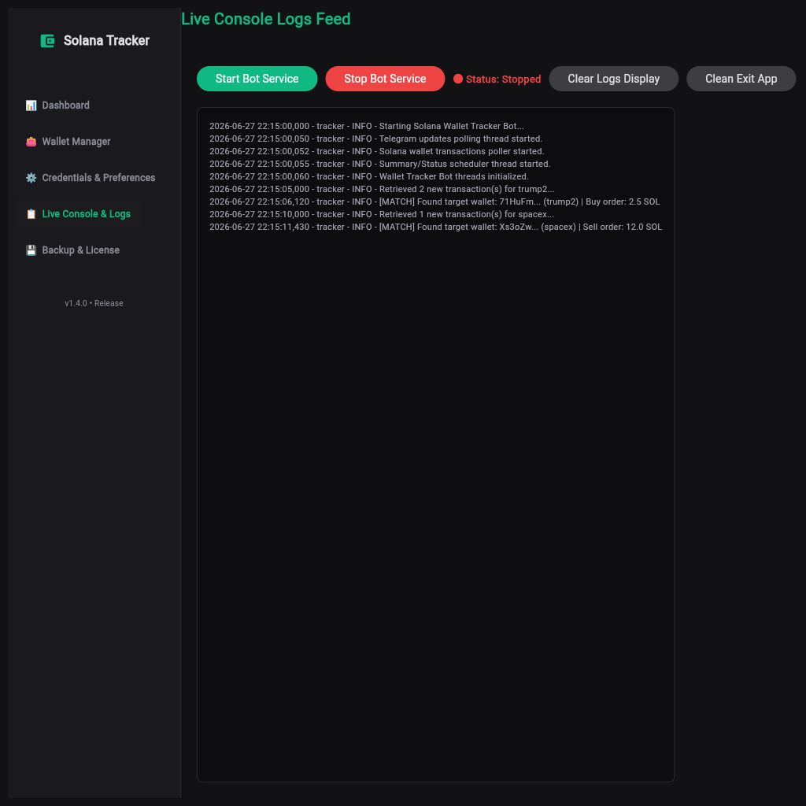

# 🧿 Solana Wallet Tracker Bot (with Desktop GUI Configurator)

A highly reliable, real-time Solana blockchain wallet and token account tracking system. The project features a background listener bot (`tracker.py`) that monitors and decodes transactions in real-time, coupled with an elegant, modern dark-themed configuration GUI panel (`configurator.py`) that allows you to configure credentials, manage tracked addresses, test API/RPC connectivity, and view live logs with zero coding required.

---

## 🚀 Key Features

* **Failover / Multi-RPC Rotation**: Support for comma-separated RPC URL lists. If the active Solana RPC node fails or hits rate limits (`HTTP 429`), the bot automatically fails over to the next configured RPC URL.
* **Smart Polling & Batch Updates**: The poller queues missing blocks and retries them on network failure, ensuring you never miss a swap/alert, while maintaining high performance.
* **Token Metrics Parsing**: Resolves swap/buy/sell metrics (converting Solana Token Accounts to real token names/symbols using Jupiter API) and outputs live values mapped to USD, NIS, EUR, CAD, etc.
* **Desktop Configuration GUI**: A clean, responsive dark-mode control panel to manage your credentials, tracking preferences, lists, and view tracker processes with a blinking running status pulse and uptime counter.
* **Asynchronous Connection Tests**: Instant validation utility in the GUI to verify Solana RPC health and Telegram Bot tokens/Chat IDs (by sending a test message) before saving configs.
* **Secure Local Storage**: Credentials and tracking states are stored locally in git-ignored files (`secrets/.env` and `secrets/tracked.json`), preventing private tokens from leaking.
* **Interactive Telegram Bot Commands**: Full control over settings directly within your Telegram group or private chat using standard commands.
* **Dynamic Multi-Language Support**: Completely translated GUI supporting English, Russian, and Arabic, applying translations dynamically to all panels, dialog boxes, errors, and warnings.

---

## 📁 Repository Structure & Architecture

```
telegramcrypt/
├── secrets/                   # Ignored by Git (sensitive data)
│   ├── .env                   # Active bot configuration (Bot Token, Chat ID, RPC URLs)
│   └── tracked.json           # Stores chat-specific tracked wallets and metadata
├── logs/                      # Ignored by Git
│   └── tracker.log            # Tracker bot application logs
├── .gitignore                 # Prevents pushing sensitive files/folders to Git
├── requirements.txt           # Python package dependencies
├── example.env                # Template showing environment variable setup
├── tracker.py                 # Core background Solana poller and Telegram handler
├── configurator.py            # Modern Flet-based desktop/web configuration GUI
├── run.sh                     # Linux/WSL shell launcher script (creates venv & launches GUI)
└── run.bat                    # Windows batch launcher script
```

---

## ⚙️ Setup & Installation

### 1. Prerequisites
* **Python**: Install Python 3.8 or higher.
* **Telegram Bot**: Message `@BotFather` on Telegram to create a new bot and obtain your **Telegram Bot Token**.
* **Telegram Chat ID**: Create a group or direct chat with your bot. Send a message in it, then you can configure the Chat ID. (Note: Group Chat IDs usually begin with a minus sign, e.g., `-100123456789`).
* **Solana RPC URL**: Get one or more RPC endpoints (e.g. from Helius, QuickNode, Ankr, LlamaNodes, or use the default public endpoint).

### 2. Quick Start Running the App

The project includes launcher scripts that automate virtual environment (`.venv`) creation, activate it, install requirements, and run the configuration panel.

#### Linux / WSL:
```bash
chmod +x run.sh
./run.sh
```

#### Windows:
Double-click `run.bat` or run it from Command Prompt:
```cmd
run.bat
```

> [!NOTE]
> If you are running on a headless Linux server or do not want to use the GUI, you can start the Solana Wallet Tracker directly in **bot-only mode**:
> ```bash
> ./run.sh --bot-only
> ```
> Or directly run it via Python:
> ```bash
> python3 tracker.py
> ```

---

## 🛡️ Security & Environment Strategy

To prevent sensitive credentials (such as your Telegram Bot API Token or custom RPC nodes) from being accidentally committed to public repositories:
1. All private configurations are stored in `secrets/.env`.
2. All tracked wallet databases are stored in `secrets/tracked.json`.
3. The folder `secrets/` is explicitly listed in `.gitignore`.
4. A template file `example.env` is available in the root folder to show the environment structure.

---

## 🖥️ Desktop Configuration Panel

The Configuration Panel (`configurator.py`) is written in Flet (Flutter-based Python framework) and runs as a native desktop application. On headless Linux or WSL environments (lacking X11 display capabilities), it automatically falls back to launch as a local web service running on `http://127.0.0.1:8550`.


*Main Dashboard for bot activation, credentials management, and live log monitoring.*


*App Settings Panel supporting multiple languages (English, Russian, Arabic), font sizes, and dark/light modes.*


*Live Console and Log Filtering Tab.*

1. **Credentials Management**:
   * **Telegram Bot Token**: Insert and hide/show your token.
   * **Telegram Chat ID**: Save the target chat where notifications will go.
   * **Solana RPC URL**: Put single or multiple comma-separated RPC URLs for automatic failover.
   * **Test Connections**: Validate RPC health and Telegram bot details with a single click.
2. **Preferences**:
   * **Default Currency**: Choose your conversion currency (USD, NIS, EUR, CAD, GBP, AUD) for price alerts.
   * **Summary Interval**: Choose how often the bot sends logs (1 min for real-time alerts, or longer periods to accumulate summaries. Minimum interval is 1 minute).
   * **Auto-start**: Option to automatically boot the background tracking service on configurator launch. This automatically forces the Telegram chat status to active (skips the need to run `/start` on Telegram).
3. **Wallet Address Manager**:
   * **User Wallets**: Tracks all trades and token transfers associated with the wallet.
   * **Token Accounts**: Tracks transactions on a single specific token.
   * *Double-click* any address in the manager lists to copy it immediately.
4. **Execution Console**:
   * **Start / Stop Tracker Bot**: Launches or kills the background tracker process.
   * **Status Dot & Uptime**: A pulsing status dot flashes green when active, displaying a real-time `Uptime: HH:MM:SS` counter.
    * **Live Monospace Logs**: Color-coded view of application logs (`INFO` in blue, `WARNING` in yellow, `ERROR` in red) to monitor operations.

### 📸 Automated Screenshot Capture & Censorship
For documentation and release updates, an automated screenshot utility is included. Run:
```bash
.venv/bin/python capture_screenshots.py
```
This script automatically backs up your settings, populates safe mock data, starts the Flet web server headlessly using Playwright, navigates through all tabs, captures square (`1024x1024`) dark-themed screenshots into `assets/`, and restores your original configuration files when done.

---

## 🤖 Telegram Bot Interface & Commands

If the bot is running, users with access to the configured chat can execute commands directly:

| Command | Usage | Description |
| :--- | :--- | :--- |
| `/start` | `/start` | Enables alert notifications for the chat. |
| `/stop` | `/stop` | Disables alert notifications. |
| `/help` or `/h` | `/help` | Lists all available bot commands. |
| `/add` | `/add <u/w> <address>` | Adds a wallet address: `u` for User Wallets, `w` for Token Accounts. |
| `/remove` | `/remove <address>` | Stops tracking and removes the specified address. |
| `/name` | `/name <address> <name>` | Sets a friendly custom nickname for a tracked address. |
| `/show` | `/show` | Lists all currently tracked addresses. |
| `/balance` | `/balance` | Fetches and displays current Solana balances for tracked wallets. |
| `/currency` | `/currency [<USD/NIS/EUR/etc.>]` | Views or updates the fiat currency for price conversions. |
| `/interval` | `/interval [<minutes>]` | Views or updates summary interval (1 for real-time, >1 for accumulated reports). |
| `/export` | `/export` | Exports tracking details. |

---

## 🛠️ Troubleshooting & Logs

* **Bot fails to start**: Check if the `.env` file exists at `secrets/.env` and has valid values.
* **Logs are not updating**: Logs are saved in `logs/tracker.log`. You can click **View Logs** in the desktop GUI configuration panel to see color-highlighted outputs in real-time.
* **No notifications received**: Check the Chat ID. Remember that group Chat IDs usually begin with a minus (`-`). If you just created the bot, you must send at least one message to the chat first so the bot can fetch active chat metadata.
